# AccNet UDP/IP Core for AMD KR260

<!-- TOC -->

- [AccNet UDP/IP Core for AMD KR260](#accnet-udpip-core-for-amd-kr260)
    - [Introduction](#introduction)
    - [Echo-back test design](#echo-back-test-design)
    - [Complete design for Network Acceleration](#complete-design-for-network-acceleration)
        - [Getting Started](#getting-started)
        - [Linux kernel driver](#linux-kernel-driver)
        - [Integration with middlewares](#integration-with-middlewares)
    - [Start with development](#start-with-development)
        - [Synthetize your own bitstream](#synthetize-your-own-bitstream)
        - [Integrate IP in your design](#integrate-ip-in-your-design)
    - [Internals](#internals)
        - [Overview](#overview)
        - [Design](#design)
        - [Source folder structure](#source-folder-structure)
        - [Resources utilization and benchmarks](#resources-utilization-and-benchmarks)
        - [RTL testing with simulation](#rtl-testing-with-simulation)

<!-- /TOC -->

## Introduction

AccNet UDP/IP Core is an FPGA IP core which realizes UDP networking offloading taking advantage of the programmable logic (PL) of the Zynq Ultrascale+ SoC.

Packets are transmitted and received directly over high-speed Ethernet interfaces (10 GbE via SFP+ and 1 GbE via PL Ethernet MAC) and processed in Programmable Logic up to the UDP layer. Applications running on the Processing System (PS) can thus access UDP payloads directly, bypassing the traditional stack, reducing CPU load, and minimizing latency. 

The core is fully integrated with Linux, ensuring seamless adoption in robotics applications, while offering straightforward integration for bare-metal applications running on APU, RPU, or AMD MicroBlaze™ soft core. 

The FPGA designs in this repository targets the AMD KR260 FPGA SoC board, specifically:

*  FPGA: `XCK26-SFVC784-2LV-C` (or `-I`, if industrial-grade)
*  PHY: TI DP83867ISRGZ (1 GbE PL Ethernet MAC)
*  PHY: 10G BASE-R PHY IP core and internal GTY transceiver (10 GbE via SFP+)

All examples are supplied with a ready-to-flash FPGA bitstream, scripts and documentation that describes the setup and allows to synthetize and implement the bistream from source.

## Echo-back test design

The echo-back design can be used to test out the newtork setup.
The design by default listens to UDP port 1234 at IP address 192.168.1.128 and will echo back any packets received. 
The design will also respond correctly to ARP requests.  

Depending on the network interface of interest, you can get started with a specific hardware setup.

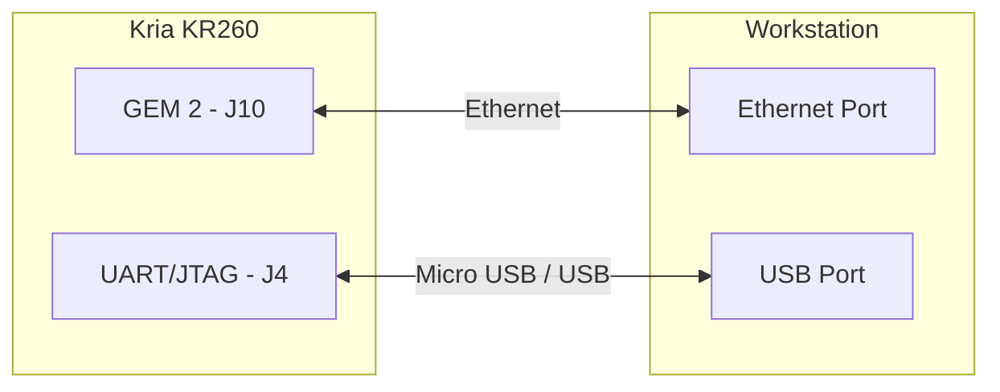

")

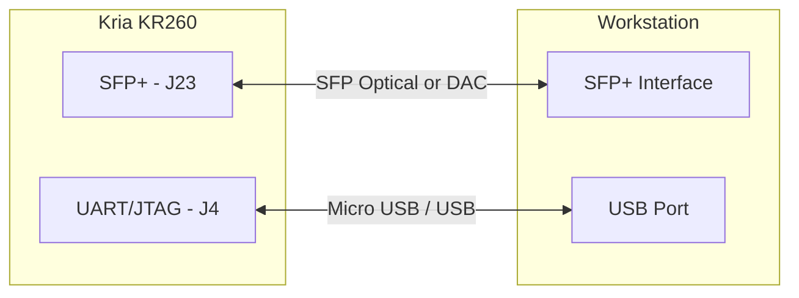

")

Connect the KR260 GEM2 Ethernet port (top left) to a 1G Ethernet NIC in your workstation or connect the KR260 SFP+ port to a 10G Ethernet NIC in your workstation depending on your preferred choice.

On your workstation, assign a static IP in the network 192.168.1.0/24, i.e.:

```bash
$ git clone git@github.com:ros-acceleration/acc_net_udp_core.git
$ sudo ip addr add 192.168.1.20 dev <if-name>
```

Clone this repository and change into `1gbe-accel` or `10gbe-accel` folder:

```bash
$ cd acc_net_udp_core/10gbe-accel # or
$ cd acc_net_udp_core/1gbe-accel
```

If Vivado is not in your `PATH`, remember to source the `settings64.sh` script, which typically resides in the Vitis installation folder, i.e.:

```bash
$ source /tools/Xilinx/Vitis/<your-version>/settings64.sh
```

From the example folder, program the KR260 board with Vivado's Hardware Device Manager (via JTAG) using the `program.tcl` script:

```bash
$ vivado -nojournal -nolog -mode batch -source scripts/program.tcl
```

The script will use Vivado Hardware Manager to flash the bitstream `fpga.bit` located in the `bitstreams` folder.
Then open a terminal and run in your host machine

```bash
$ netcat -u 192.168.1.128 1234
```

to open a UDP connection to port 1234.  Any text entered into netcat will be echoed back after pressing enter.

## Complete design for Network Acceleration

### Getting Started

This design consists of a complete setup with the cooperation between FPGA and Linux.
It can be used to establish a complete setup to start working with FPGA-UDP networking on Linux.

Connect the KR260 GEM2 Ethernet port (top left) to a 1G Ethernet NIC in your workstation or connect the KR260 SFP+ port to a 10G Ethernet NIC in your workstation depending on your choice.

To reproduce the setup, is suggested to use the official Ubuntu 22.04 LTS version for KR260 board, available from [here](https://ubuntu.com/download/amd). Download the Ubuntu image for Kria KR260 board (Kria™K26 SOMs) and flash the image into a SD card. You can follow the official ["Getting Started"](https://www.xilinx.com/kr260-start) to complete this step.

When you are ready, log into to the KR260 board using UART connection (typically available on `/dev/ttyUSB1` with `115200` as baudrate) or via SSH if available. When connected, clone the repository:

```bash
$ git clone git@github.com:ros-acceleration/acc_net_udp_core.git
$ cd acc_net_udp_core/10gbe-accel # or
$ cd acc_net_udp_core/1gbe-accel
```

and copy the folder `udp_ip_core` inside `bitstreams` into the pre-defined folder for FPGA-accelerators:

```bash
$ cp -r <source-folder>/bitstreams/udp-ip-core /lib/firmware/xilinx/
```

These files should be now available in `/lib/firmware/xilinx/udp_ip_core`:

```bash
$ ls /lib/firmware/xilinx/udp-ip-core
- shell.json            # describes to dfx-manager how the accelerator should be loaded
- udp_ip_core.bit.bin   # bitstream in xclbin format
- udp_ip_core.dtbo      # device-tree overlay
```

From now on, using `xmutil`, you are able to load/unload the bitstream onto FPGA.
Before loading `udp_ip_core`, you should unload the default `k26-starter-kits` which is loaded, by default, on Ubuntu.

```bash
$ sudo xmutil unloadapp             # Unload currently loaded accelerator
$ sudo xmutil loadapp udp_ip_core   # Load udp_ip_core accelerator
```

If you want to load `udp_ip_core` automatically at boot, you can change the content of `/etc/dfx-mgrd/default_firmware` file, that indicates the name of the accelerator to be loaded by default by dfx-manager.

When `udp_ip_core` is loaded, the workstation should be able to detect successfully the connection.
At this point, you can start testing send/receive capability.

On your workstation, assign a static IP in the network 192.168.1.0/24, i.e.:

```bash
$ sudo ip addr add 192.168.1.20 dev <if-name>
```

### Linux kernel driver

On Ubuntu, load the Linux kernel loadable module driver or use the user-space driver for a quick-and-dirty test. You can find instructions on how to load the kernel module and use the user-space driver directly from the [kernel driver](kernel/README.md) folder.

### Integration with middlewares

AccNet UDP/IP Core can be leverage to offload networking functions required by a middleware (such as DDS). You can find instructions on how to leverage it with your DDS middleware in the [integration](integration/) folder

## Start with development

### Synthetize your own bitstream

In case you want to start synthetize a bitstream for a different FPGA model or develop your own project on top of it, you can follow the following instructions.

> **Note**: This steps should be performed on your workstation, where AMD Vivado is installed.

Clone this repository and its submodules (if you have already cloned it, download submodules only):

```bash
$ git clone git@github.com:ros-acceleration/acc_net_udp_core.git
$ git submodule init
$ git submodule update
```

In the root of the repository the folder `verilog-ethernet` will be populated. `verilog-ethernet` is a collection of Ethernet-related components for gigabit, 10G, and 25G packet processing (8 bit and 64 bit datapaths).  Includes modules for handling Ethernet frames as well as IP, UDP, and ARP and the components for constructing a complete UDP/IP stack.

To start synthetize your own bitstream, navigate to `src` folder of this example:

```bash
$ cd src
```

If Vivado is not in your `PATH`, remember to source the `settings64.sh` script, which typically resides in the Vitis installation folder, i.e.:

```bash
$ source /tools/Xilinx/Vitis/<your-version>/settings64.sh
```

The `src` folder contains `rtl` folder with setup specific RTL, `lib/eth` which is a symbolic link to common `verilog-ethernet` components library and `fpga` which will contain the Vivado project and generated files (simulation, logs, ..). To start the project generation, synthesis, implementation and bitstream generation:

```bash
$ make          # 10 GbE project generation, synthesis
$ make dtbo     # generate the device tree overlay binary
```

By default, 10 GbE project is generated and synthetized. If you want to go for 1 GbE:

```bash
$ make 1gbe     # 1 GbE project generation, synthesis, ..
```

In any cases, the generated bitstream will be located in `fpga/output_overlay` folder, under the name `udp_ip_core.bit.bin`.
The device tree binary overlay `udp_ip_core.dtbo` is generated compiling the device-tree `udp_ip_core.dtsi`.

Furthermore, you can inspect the Vivado project opening `udp_ip_core.xpr` file

```bash
$ vivado fpga/udp_ip_core.xpr
```

Example of Vivado project design for 10 GbE:

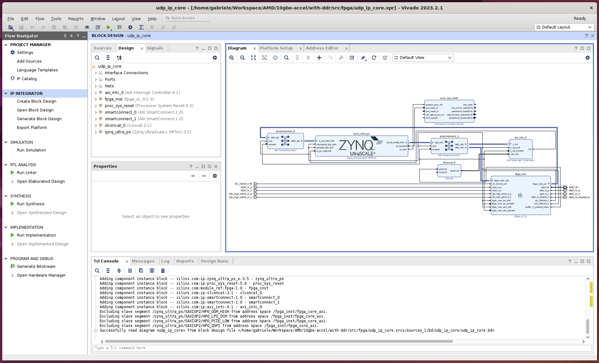

Example of Vivado project design for 1 GbE:

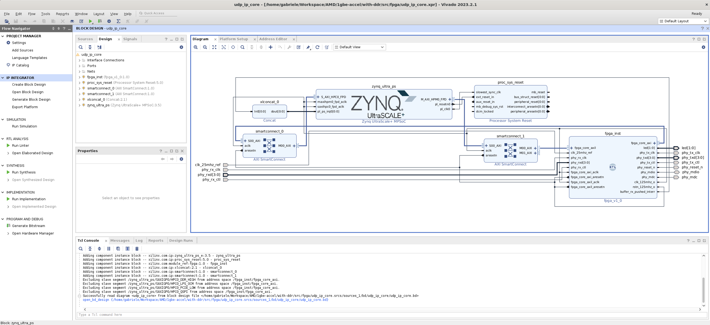

### Integrate IP in your design

The following picture shows IP ports, depending on 10 GbE or 1 GbE selection. 
A table, with all ports description follows.

")
")


| Signal                    | Direction | Description                                                               |
|---------------------------|-----------|---------------------------------------------------------------------------|
| `clk_25mhz_ref`           | Input     | Reference 25 MHz input clock.                                             |
| `fpga_core_axi_aclk`      | Input     | Clock for AXI4 master interface.                                          |
| `fpga_core_axi_aresetn`   | Input     | Active-low reset for AXI4 master.                                         |
| `fpga_core_axil_aclk`     | Input     | Clock for AXI4-Lite interface.                                            |
| `fpga_core_axil_aresetn`  | Input     | Active-low reset for AXI4-Lite interface.                                 |
| `clk_125mhz_o`            | Output    | 125 MHz output clock, derived for memory sync.                            |
| `rstn_125mhz_o`           | Output    | Reset signal associated with 125 MHz clock.                               |
| `fpga_core_axi_*`         | Mixed     | Full AXI4 master interface. Used for reading/writing memory buffers.      |
| `fpga_core_axil_*`        | Mixed     | AXI4-Lite slave interface for register access.                            |
| `phy_*`                   | Mixed     | RGMII interface to connect to the external PHY (1 GbE)                    |
| `sfp_*`                   | Mixed     | SFP+ interface to connect to the external SFP+ (10 GbE).                  |
| `led[1:0]`                | Output    | User LEDs. Blink when data is received.                                   |
| `buffer_rx_pushed_interr` | Output    | Interrupt output for received buffer event.                               |


If you want to integrate the IP in your design, you can follow the classic Vivado flow:

1. **Create a Block Design** in Vivado IP Integrator.
2. **Instantiate the IP core** (e.g., `fpga_inst`).
3. Connect:
   - **AXI4 master interface** to Zynq PS High Performance Master port (`M_AXI_HPM0_FPD`) via SmartConnect.
   - **AXI4-Lite interface** to Zynq PS General Purpose Slave port (`S_AXI_HPC0_FPD`).
   - **Clocks and resets** as appropriate (e.g., `clk_25mhz_ref` as input).
4. **Assign external PHY pins** via your XDC constraints for the RGMII signals.
5. **Handle the interrupt**:
   - Connect `buffer_rx_pushed_interr` to one of the Zynq PS interrupt inputs (e.g., `pl_ps_irq0[0]`).
   - In the `udp_ip_core.dtsi` device-tree overlay source, update the `fpga@a0010000/interrupts` node accordingly with the connected interrupt number. `pl_ps_irq0` exposes interrupts from 0x59 (`pl_ps_irq0[0]`) to 0x60 (`pl_ps_irq0[7]`) while `pl_ps_irq1` from 0x68 (`pl_ps_irq1[0]`) to 0x6F (`pl_ps_irq1[7]`). 
6. **Address Mapping**:
   - Define address space for AXI-Lite registers.
   - Ensure AXI4 master accesses are mapped to valid memory space.
7. **Export hardware** including the bitstream (`.xsa`) for software development.

A ready-to-use example, with all connections and setup can be found in `ip/zynq_ps.tcl`.

## Internals

### Overview

The UDP-IP core aims at offloading part of the Ethernet UDP-IP stack from the main processor (Processing System, PS) leveraging the FPGA (Programmable Logic, PL) capabilites in terms of acceleration. In particular, the stack cut takes place at UDP level, what means that the processor shall operate from UDP upwards in the OSI model while the FPGA shall take charge of wrapping / unwrapping the incoming and outgoing packets in the lower layers. The communication of UDP packets between processor and FPGA is performed via DDR. Additionally, several registers are exposed on the FPGA's side via AXI lite to provide a mechanism for the processor to configure the FPGA core.

### Design

A general block diagram describing the PL design along with the PL-PS communication features is provided below.

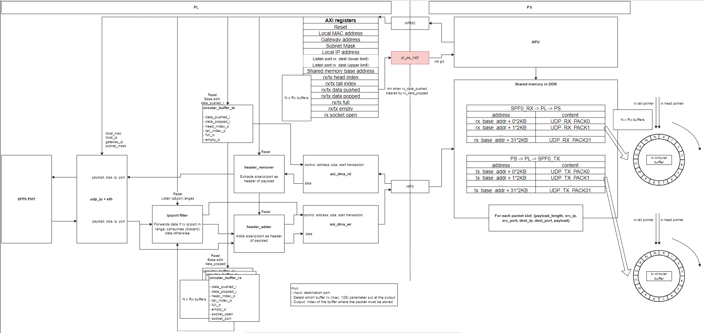

The core features are described below:

**SFP PHY**\
Handles the physical layer based on SFP transceiver. 

**Ethernet UDP/IP wrapper and unwrapper**\
Allows packaging and unpackaging data between UDP and Ethernet layers.

**Ring buffer controller**\
The mechanism to orchestrate the interchange of UDP packets via DDR. This element manages the PL-PS communication by virtually creating several buffers at DDR (one or more for incoming packets, rx buffer, and another for outgoing packets, tx buffer). These buffers are described as virtual as the DDR memory itself only contains raw addresses; however, the ring buffer controller shall be aware of the DDR base address allocated by the PS and shall tell the PS and the PL where they should read from and write to in each of the buffers according to the current buffers status.

Each buffer controller handles the head and tail indexes and the full and empty status, and can be manipulated through push and pop inputs.

Each buffer slot contains, for a given packet, the payload size, the source IP and port, the destination IP and port and the payload itself. The 5 first fields (packet header = {payload_size, source_ip, source_port, dest_ip, dest_port}) are all 64-bit wide.

The buffer size (number of slots and size per slot) is configurable by changing the corresponding parameters in the RTL source code during buffers instantiation (BUFFER_RX_LENGTH, BUFFER_TX_LENGTH and BUFFER_ELEM_MAX_SIZE parameters, defined at fpga.v). Changing them requires regenerating synthesis, implementation and bitstream. By default, buffer controllers are configured to handle 32 2KB slots per buffer (requiring a total of 128KB)

Each rx buffer is bound to a specific port, what means that incoming packets will be sent to the buffer bound to the packet's destination port. A maximum range of MAX_UDP_PORTS ports / rx buffers (parameter defined at fpga.v) will be implemented. The higher this number, the higher the resources required for implementation. Besides, the lowermost port can be defined through the configuration AXI registers from the processor side (register ADDR_UDP_RANGE_L_0_N_O, set to udp_port_listened_lower in udp_ip_core_driver.c); therefore, the ports being listened are [lower_port + MAX_UDP_PORTS - 1]. Finally, to open a port, udp_ip_core_driver_set_socket_open function is provided in the udp_ip_core_driver API

Interaction between the PL and the rx buffer: anytime the PL receives a new packet incoming from the SFP connection, it unwraps the packet until obtaining the UDP content and waits for the rx buffer to not be full; then, it sends the payload along with a header to the next available slot in the buffer. Finally, it performs a push operation to the rx buffer, which updates its variables correspondingly.

Interaction between the PL and the tx buffer: anytime the tx buffer is not empty, the PL reads from the buffer in DDR at the corresponding slot and brings the UDP packet; once it has delivered the payload to the following modules to be wrapped as Ethernet UDP/IP, it notifies the buffer with a pop operation.

Similarly, the PS may interact with the rx buffer in order to check if there is any available rx packet to read from DDR or with the tx buffer to wait for an available slot before pushing a new packet towards DDR.

**AXI configuration registers**\
Allows the PS to control the PL core. In particular, the former can reset the latter, set some general parameters (e.g. local ip, gateway, base address of shared memory, etc.) and interact with the buffers controllers.
Registers are defined in: `config_regs_AXI_Manager.v`. Below a table describing the fields:

| Description                                                                       | Address label                      | Accesibility from PS |
|-----------------------------------------------------------------------------------|------------------------------------|----------------------|
| Kernel control. Unsued as the core is not handled as a typical kernel             | ADDR_AP_CTRL_0_N_P                 | RW                   |
| User reset. The PL core gets reset when the register contains a 1                 | ADDR_RES_0_Y_O                     | RW                   |
| Local MAC (lower 4 bytes)                                                         | ADDR_MAC_0_N_O                     | RW                   |
| Local MAC (2 LSB in this field contains MAC 2 LSB; 2MSB in this field ignored)    | ADDR_MAC_1_N_O                     | RW                   |
| Gateway                                                                           | ADDR_GW_0_N_O                      | RW                   |
| Subnet mask                                                                       | ADDR_SNM_0_N_O                     | RW                   |
| Local IP                                                                          | ADDR_IP_LOC_0_N_O                  | RW                   |
| Lower port to be listened for incoming packets                                    | ADDR_UDP_RANGE_L_0_N_O             | RW                   |
| Higher port to be listened for incoming packets                                   | ADDR_UDP_RANGE_H_0_N_O             | RW                   |
| Base address of the DDR shared memory, allocated by the PS                        | ADDR_SHMEM_0_N_O                   | RW                   |
| Interrupt set register. Not functional for now                                    | ADDR_ISR0                          | RO                   |
| Interrupt enable register. Not functional for now                                 | ADDR_IER0                          | RO                   |
| Interrupt: global interrupt enable. Not functional for now                        | ADDR_GIE                           | RO                   |
| Buffer Tx. Head index                                                             | ADDR_BUFTX_HEAD_0_N_I              | RO                   |
| Buffer Tx. Tail index                                                             | ADDR_BUFTX_TAIL_0_N_I              | RW                   |
| Buffer Tx. Empty status                                                           | ADDR_BUFTX_EMPTY_0_N_I             | RW                   |
| Buffer Tx. Full status                                                            | ADDR_BUFTX_FULL_0_N_I              | --                   |
| Buffer Tx. Push buffer                                                            | ADDR_BUFTX_PUSHED_0_Y_O            | RO                   |
| Buffer Tx. Pop buffer                                                             | ADDR_BUFTX_POPPED_0_N_I            | RO                   |
| Buffer Rx. Interrupts. Not functional for now                                     | ADDR_BUFRX_PUSH_IRQ_0_IRQ          | RO                   |
| Buffer Rx. Offset that defines the position for the first Rx buffer               | ADDR_BUFRX_OFFSET_0_N_I            | RO                   |

To save up space, RX buffer parameters are stored all together in a 32-bit word per each rx buffer, unlike TX buffer parameters which are provided as one parameter per register.

### Source folder structure

```
📦 src
├── 📂 rtl
│   ├── 📄 fpga.v: Top module of the core.
│   ├── 📄 fpga_core.v: Instantiation of logics.
│   └── 📄 controller.v: PL-PS interoperability (buffers, control registers, ...).
├── 📂 fpga
│   └── Scripts used to generate output files (Vivado project, bitstream, xclbin).
├── 📂 ip
│   └── 📄 zynq_ps.tcl: Generates the block design containing the Zynq PS block.
├── 📂 tb
│   └── Testbenches to verify main functionalities, with fpga_core as the DUT.
└── 📄 Makefile: automates the process of generating the output files.
```

### Resources utilization and benchmarks

**FPGA resources report (with 64 RX buffer)**

- 1 GbE

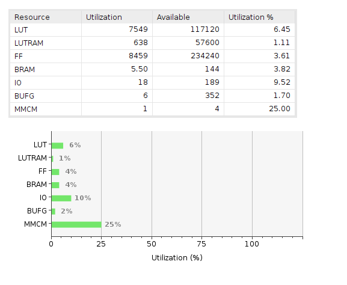

- 10 GbE

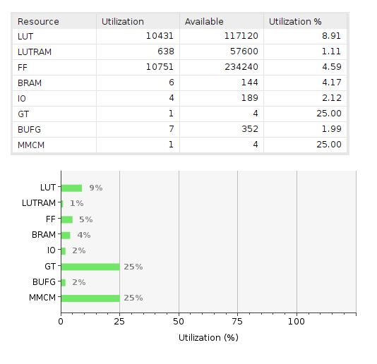

**FPGA resources report (with 1024 RX buffers)**

- 1 GbE

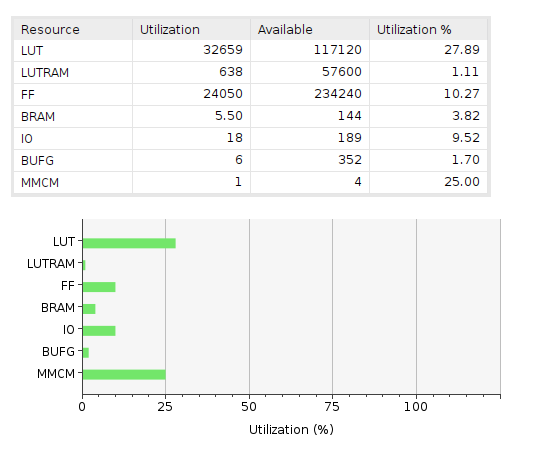

- 10 GbE

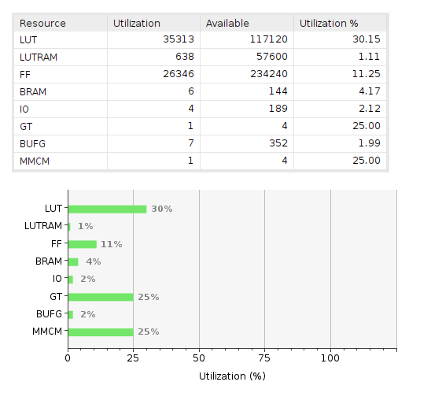

Increasing the number of RX buffers has a significant increase on resource utilization, mainly due to the extra logic necessary to filter the incoming packets and handle the buffer parameters.

### RTL testing with simulation

The verification is performed with cocotb open source environment. Several tests are provided under `<project-root>/src/tb/fpga_core/test_fpga_core.py` with the purpose of testing UDP-IP core top file.

Focusing on top tests (`test_fpga_core.py`), these are based on the following structure:

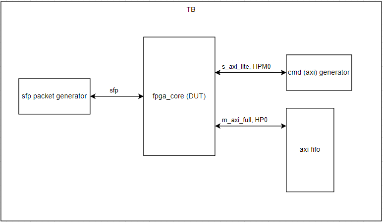

The simulation environment consists in generating network packets and adding a RAM block accessible via AXI4 full interface (simulating the shared memory that would enable PL-PS communication in the hardware) as well as an AXI Lite interface to access the configuration registers. 

A few examples of the output visualized as waveform are provided below:

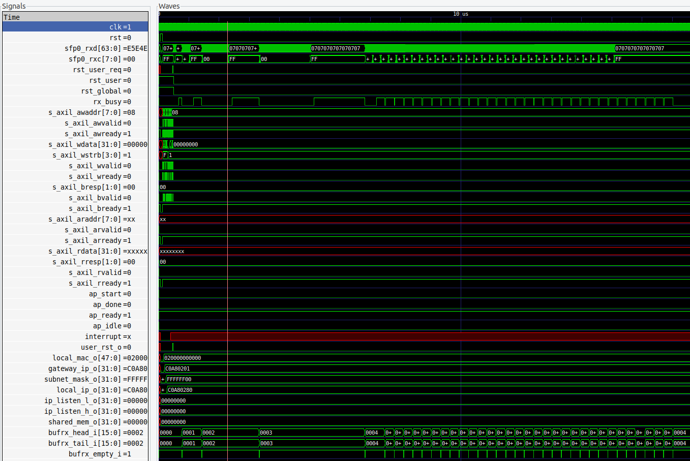
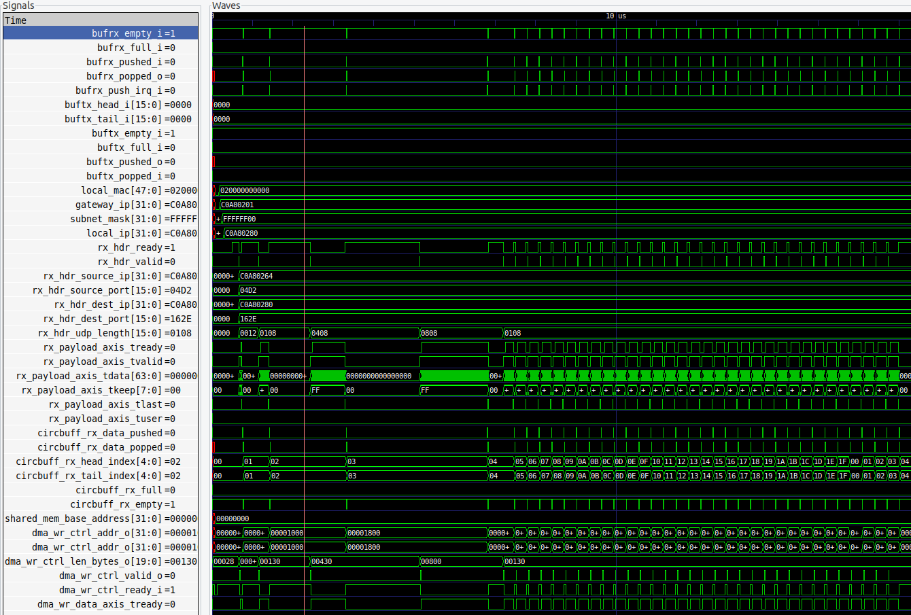
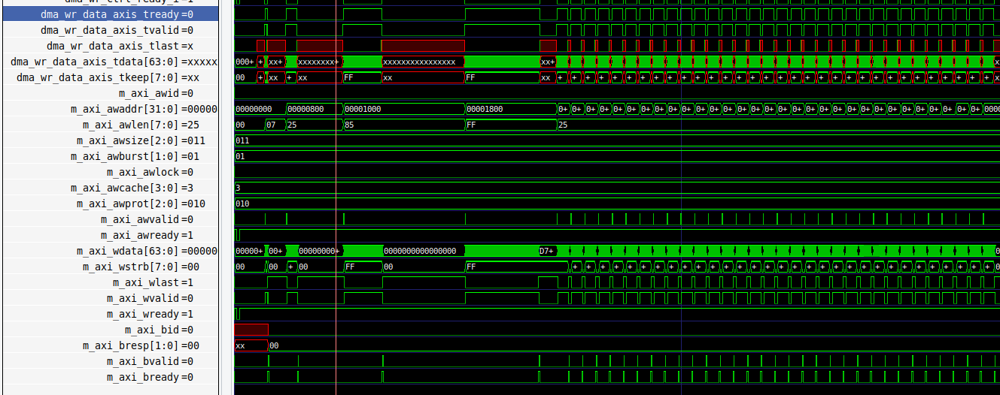

To run tests described in `test_fpga_core.py` (please make sure to install the required dependecies before: python3, cocotb, cocotbext, scapy, icarus, gtkwave):

```bash
cd src/tb/fpga_core/
make
gtkwave fpga_core.fst # To visualize waveforms with gtkwave
```
